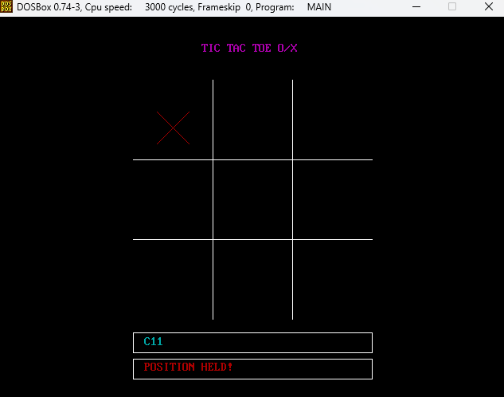

## Tic tac toe - assembly x86_16 :construction:

## Instructions
### How to run
This program should be executed in Windows using DosBox environment

 - Compile **main.asm** using NASM as we did on the labs:
```
nasm main
```
 - Link **.o** files using _freelink_:
```
freelink main
```
 - Run the game:
```
main
```

### How to play
It starts in a black screen. This screen wait for an input from your keyboard. Whatever the input, the screen remains black unless you type "**s**" or "**c**".

 - "**s**" is for close the game
 - "**c**" is for start the game

When the game starts, you'll see a screen like this:


#### It has 2 options to play:
 - X
 - C

_The character **C** represents the circle._

#### The move should has 3 characters:
 - symbol (X/C)
 - line (1, 2 or 3)
 - column (1, 2 or 3)

and the move happens when you type the **ENTER** key
#

_For example:_
**X11** generates the move below:


 - You can't move over a held position or play with the same symbol twice. If you do this, a message will appear on the screen and your move won't be processed.



 - There's a case which it gets a buffer overflow. In this case, a message will appear on the screen and your input won't be processed. You can delete all the characters and type again, or delete one character and type **ENTER** to print the wrong command and reset the buffer.


#

When the game ends, a message will appear on the screen showing the winner if is the case. Wait a time and a message "**press any key to close**" will appear and you exit the game.


## Implementation details
### Player moves and board masks
Each playe move and all the positions that have already been played are
represented as 2 bytes, where the least significant 9 bytes represent the positions
on the board. 

If the bit on the position is set to 1, that means that position has been played
by one of the players. The same idea applies for each player move.

#### Representation:
We represent the player moves as well as the board positions as follows: 

**Look the image table.png**


board/moves: 0000000x.xxxxxxxx

So, we can figure out if a player has won the match or if the board if full by
means of some masks. Let's define them:  

##### Board is full:
If the board is full, that means all the 9 least significant bytes are 1,
meaning all positions have been taken, so let's define a mask for that: 

board full mask: 00000001.11111111 => 0x01ff

##### Player won with sequence 012:
won 012 mask: 00000000.00000111 => 0x0007

##### Player won with sequence 345:
won 345 mask: 00000000.00111000 => 0x0038

##### Player won with sequence 678:
won 678 mask: 00000001.11000000 => 0x01C0

##### Player won with sequence 048:
won 048 mask: 00000001.00010001 => 0x0111

##### Player won with sequence 642:
won 642 mask: 00000000.01010100 => 0x0054

##### Player won with sequence 630:
won 630 mask: 00000000.01001001 => 0x0049

##### Player won with sequence 741:
won 741 mask: 00000000.10010010 => 0x0092

##### Player won with sequence 852:
won 852 mask: 00000001.00100100 => 0x0124
